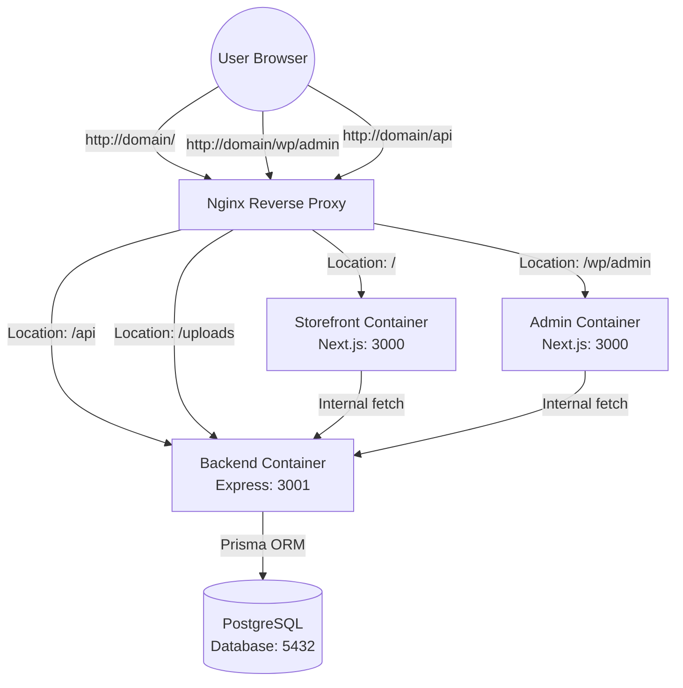
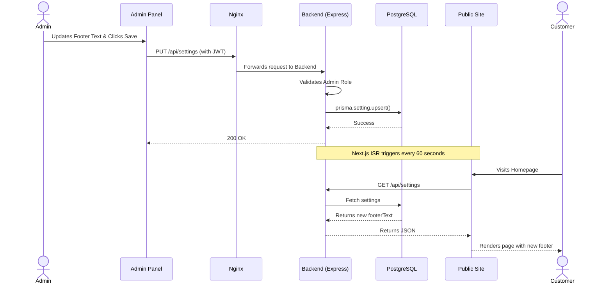
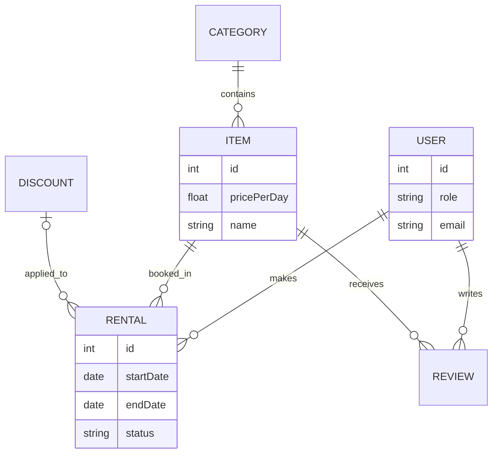

# EquipRent System Architecture

This document describes the high-level architecture and workflows of the EquipRent platform.

## 1. High-Level Architecture

The platform is built using a modern, scalable microservice-like architecture orchestrated by Docker Compose. It consists of the following core components:

- **Nginx (Reverse Proxy)**: Routes incoming traffic to the appropriate container based on the URL path.
- **Storefront (Next.js)**: The public-facing e-commerce application for customers.
- **Admin Panel (Next.js)**: The private dashboard for managing equipment, orders, and settings.
- **Backend API (Express.js)**: The central business logic layer serving both frontends.
- **Database (PostgreSQL)**: The persistent storage layer accessed via Prisma ORM.

## 2. Dynamic Settings Workflow (Example: Footer)

To demonstrate how data flows through the system, here is the sequence of events when the Admin changes the dynamic footer text:

## 3. Data Schema Overview

The core data models managed by Prisma:

- **User**: Customers and Admins. Stores credentials, contact info, and role.
- **Item & Category**: The catalog of rental equipment.
- **Rental**: Transactions linking a User to an Item for a specific date range.
- **Review**: Customer feedback on items.
- **Setting**: Key-value pairs for global application configuration (e.g., currency, footer text).

