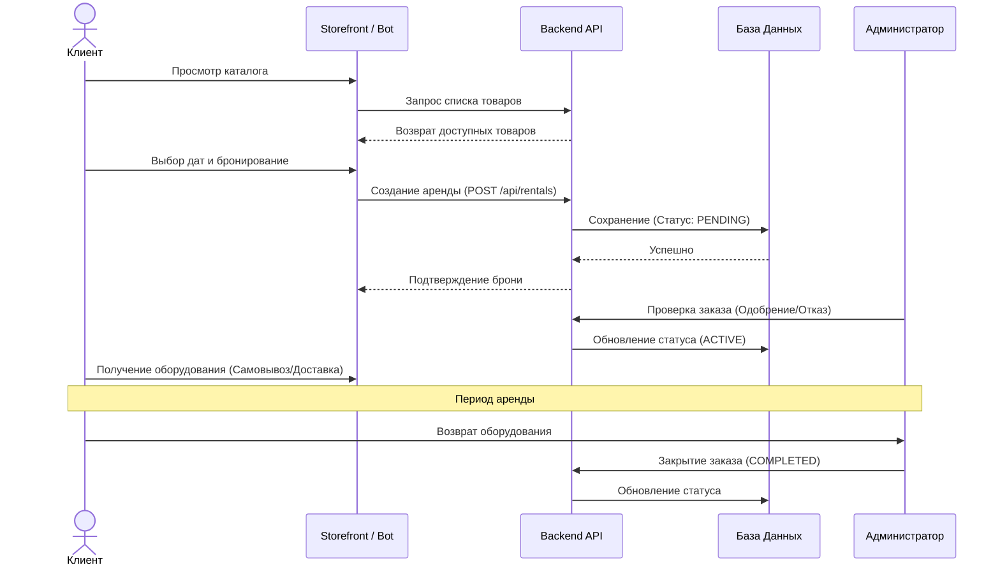
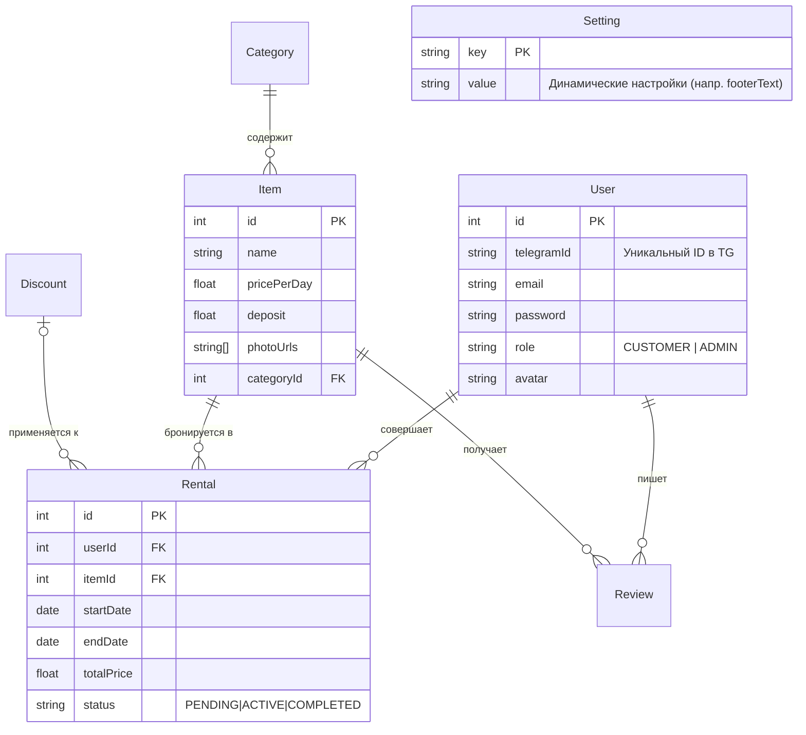
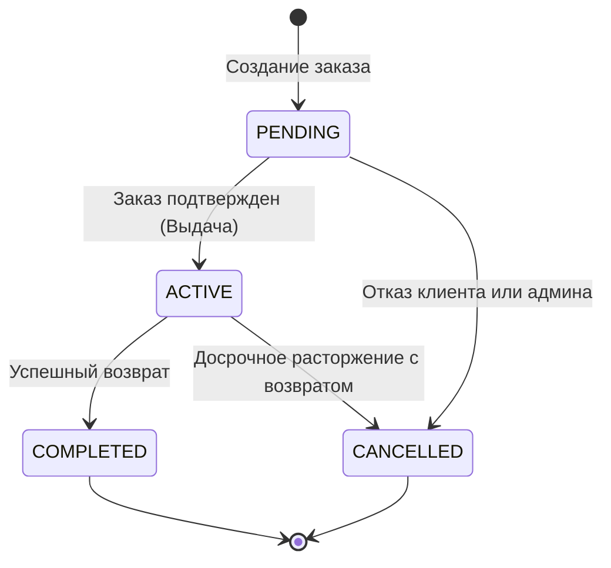

# Архитектура Платформы EquipRent

В этом документе описывается глобальная архитектура, жизненные циклы и схемы базы данных нашей комплексной платформы для аренды оборудования. Платформа объединяет веб-сайт (Storefront), панель управления (Admin) и Telegram-бота.

## 1. Глобальная Архитектура (System Architecture)

Система построена на микросервисной архитектуре и оркестрируется с помощью Docker Compose.

```mermaid
graph TD
    Client((Клиент / Браузер))
    TG((Telegram App))

    subnginx[Nginx Reverse Proxy\n(Порт 80)]
    
    substorefront[Storefront Container\nNext.js: 3000]
    subadmin[Admin Container\nNext.js: 3000]
    subbackend[Backend API Container\nExpress: 3001]
    subbot[Telegram Bot Container\nTelegraf / Node.js]
    
    subdb[(PostgreSQL\nБаза Данных: 5432)]

    Client -->|http://domain/| subnginx
    Client -->|http://domain/wp/admin| subnginx
    Client -->|http://domain/api| subnginx

    subnginx -->|Location: /| substorefront
    subnginx -->|Location: /wp/admin| subadmin
    subnginx -->|Location: /api| subbackend
    subnginx -->|Location: /uploads| subbackend

    substorefront -->|Внутренние запросы| subbackend
    subadmin -->|Внутренние запросы| subbackend
    
    TG -->|Webhook / Polling| subbot
    subbot -->|Синхронизация| subbackend

    subbackend -->|Prisma ORM| subdb
    subbot -->|Prisma ORM| subdb
```

## 2. Жизненный цикл заказа (User Flow)

Полный путь клиента от выбора товара до возврата оборудования (поддерживает как сайт, так и Telegram-бота).



## 3. Схема Базы Данных (ER Diagram)

Глобальная структура базы данных Prisma, обеспечивающая единый источник истины для сайта, админки и бота.



## 4. Жизненный цикл статусов аренды (State Machine)

Строгая диаграмма переходов статусов бронирования для предотвращения логических ошибок.



## 5. Архитектура новых Premium-модулей

Платформа включает расширенные модули для улучшения пользовательского опыта (UX) и безопасности (Security).

### 5.1 Модуль синхронизации (Telegram ↔ Storefront)
- Единый профиль пользователя (Связь через `telegramId` и `email`).
- Мгновенная синхронизация корзины и баланса (в реальном времени).
- Дублирование уведомлений: если заказ сделан на сайте, чек приходит в Telegram.

### 5.2 Модуль динамических настроек
- Позволяет администратору управлять контентом публичного сайта без перезагрузки сервера.
- Хранит данные в таблице `Setting`.
- Storefront (Next.js) использует ISR (Incremental Static Regeneration) каждые 60 секунд для обновления UI (например, текст футера или контакты).

### 5.3 Модуль юридической безопасности (Legal & Compliance)
- Внедрены статические страницы `Terms of Service` и `Privacy Policy`.
- Тексты соответствуют стандартам GDPR, PCI-DSS (обработка платежей) и AML (Anti-Money Laundering).
- Строгая проверка возраста (18+) и финансовой ответственности арендатора на этапе бронирования.
