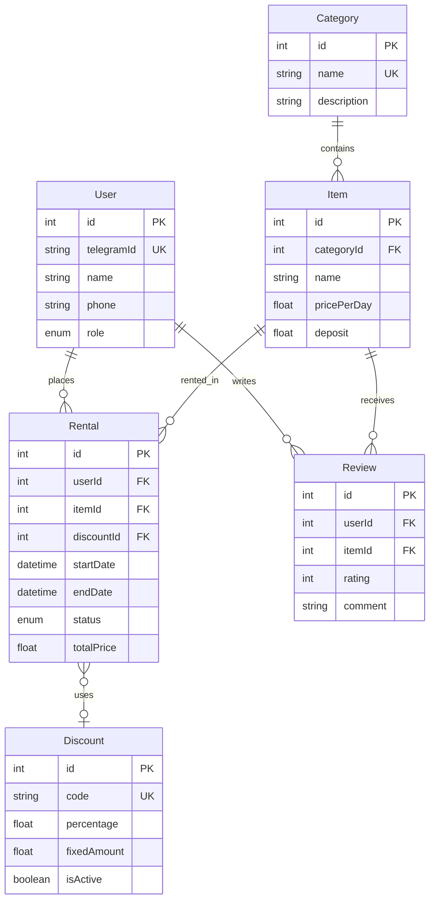

# Backend Specification: Rental Service

## 1. Architecture Overview
- **Framework:** Node.js with Express.js
- **Database:** PostgreSQL (via Prisma ORM)
- **Telegram Bot:** Telegraf library integrated into the Node.js application
- **Language:** TypeScript

## 2. Database Schema Summary

The database uses PostgreSQL, modeled via Prisma ORM.

### Models:
1. **User**
   - Stores both clients and admins.
   - Fields: `id`, `telegramId` (unique), `name`, `phone`, `role` (CUSTOMER, ADMIN).
   - Relations: One-to-many with `Rental`, `Review`.

2. **Category**
   - Groups items logically (e.g., Electronics, Tourism).
   - Fields: `id`, `name` (unique), `description`.
   - Relations: One-to-many with `Item`.

3. **Item**
   - Represents the physical items available for rent.
   - Fields: `id`, `categoryId`, `name`, `description`, `photoUrl`, `pricePerDay`, `deposit`.
   - Relations: Many-to-one with `Category`, One-to-many with `Rental`, `Review`.

4. **Rental**
   - Represents an order or rental instance.
   - Fields: `id`, `userId`, `itemId`, `discountId`, `startDate`, `endDate`, `totalPrice`, `status` (PENDING, ACTIVE, COMPLETED, CANCELLED), `notes`.
   - Relations: Many-to-one with `User`, `Item`, `Discount`.

5. **Review**
   - Client feedback on the items.
   - Fields: `id`, `userId`, `itemId`, `rating` (1-5), `comment`.
   - Relations: Many-to-one with `User`, `Item`.

6. **Discount**
   - Promo codes.
   - Fields: `id`, `code` (unique), `percentage`, `fixedAmount`, `isActive`.
   - Relations: One-to-many with `Rental`.

## 3. Basic API Endpoints Structure (Proposed)

*Note: The Telegram Bot will handle most client-facing operations. These endpoints are primarily for the Next.js Admin Panel.*

### Categories
- `GET /api/categories` - List all categories
- `POST /api/categories` - Create a new category
- `PUT /api/categories/:id` - Update category
- `DELETE /api/categories/:id` - Delete category

### Items
- `GET /api/items` - List all items (with optional category filter)
- `GET /api/items/:id` - Get item details
- `POST /api/items` - Create a new item
- `PUT /api/items/:id` - Update item details
- `DELETE /api/items/:id` - Delete item

### Rentals
- `GET /api/rentals` - List all rentals
- `GET /api/rentals/:id` - Get rental details
- `PUT /api/rentals/:id/status` - Update rental status
- `POST /api/rentals` - Create a rental manually (Admin)

### Users
- `GET /api/users` - List all users (clients)
- `GET /api/users/:id` - Get user details and rental history

### Discounts
- `GET /api/discounts` - List all discounts
- `POST /api/discounts` - Generate/Create a discount code
- `PUT /api/discounts/:id` - Update discount status

### Reviews
- `GET /api/reviews` - List all reviews

## 4. Telegram Bot Features
- **Registration**: Capture Name and Phone.
- **Catalog Navigation**: Browse categories and items.
- **Booking**: Calendar integration to pick dates, checking existing rentals.
- **Rules Agreement**: Explicit step before booking confirmation.
- **History**: Viewing user's past and active rentals.
- **Review Prompt**: Sent via cron jobs/scheduled events upon rental completion.
